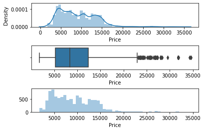
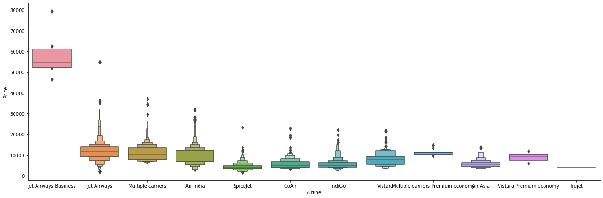
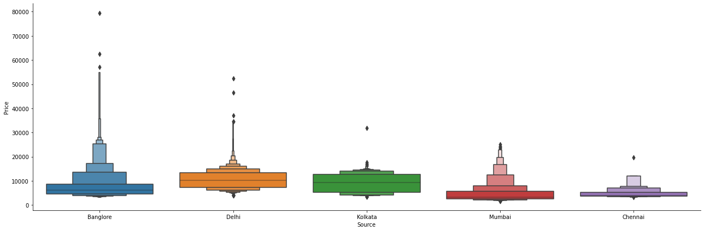

## Key Lessons
- Using OOP code to clean data. 

[@mzkhan98](https://github.com/mzkhan98)

## Table of Contents

## Business Problem 
When deciding whether to buy a plane ticket or wait to see if the price will decrease is a key factor of consideration when buying a plane ticket. 

## Methods
- Data Cleaning & Feature Engineering 
- Exploratory data analysis
- ML model creation and evaluation

## Tech Stack
- Python{Pandas, Numpy, Matplotlib, Seaborn, ScikitLearn,Plotly, Cufflinks}

## Walk Through Of Project
The first step of the product was to clean the data, the following methods were used:
#### Date Cleaning & Feature Engineering
- Invalid data points were removed using pandas. 
- Functions to featurise duration, arrival and departure time
- Feature encoding used for flight locations,airlines,stops.

Outlier detection using seaborn library to visualize the distribution of the price data. Values above Rs.35,000 replaced with the median value to allow for a more accurate distribution.

#### Exploratory Data Analysis 
Exploring the data we see all airlines have similar prices, other than JetAirways Business class.

Additionally, location also has very liitle impact on on the price, however, there are many outliers in flights from Banglore, this is since the majority of Jet Airways business class flights are from Banglore. 

## Contribution

Pull requests are welcome! For major changes, please open an issue first to discuss what you would like to change or contribute.

## License

MIT License

Copyright (c) 2022 Mohammad Z Khan

Permission is hereby granted, free of charge, to any person obtaining a copy
of this software and associated documentation files (the "Software"), to deal
in the Software without restriction, including without limitation the rights
to use, copy, modify, merge, publish, distribute, sublicense, and/or sell
copies of the Software, and to permit persons to whom the Software is
furnished to do so, subject to the following conditions:

The above copyright notice and this permission notice shall be included in all
copies or substantial portions of the Software.

THE SOFTWARE IS PROVIDED "AS IS", WITHOUT WARRANTY OF ANY KIND, EXPRESS OR
IMPLIED, INCLUDING BUT NOT LIMITED TO THE WARRANTIES OF MERCHANTABILITY,
FITNESS FOR A PARTICULAR PURPOSE AND NONINFRINGEMENT. IN NO EVENT SHALL THE
AUTHORS OR COPYRIGHT HOLDERS BE LIABLE FOR ANY CLAIM, DAMAGES OR OTHER
LIABILITY, WHETHER IN AN ACTION OF CONTRACT, TORT OR OTHERWISE, ARISING FROM,
OUT OF OR IN CONNECTION WITH THE SOFTWARE OR THE USE OR OTHER DEALINGS IN THE
SOFTWARE.

Learn more about [MIT](https://choosealicense.com/licenses/mit/) license